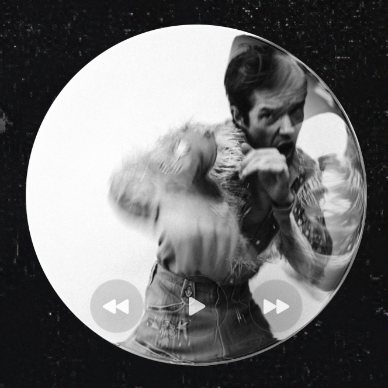
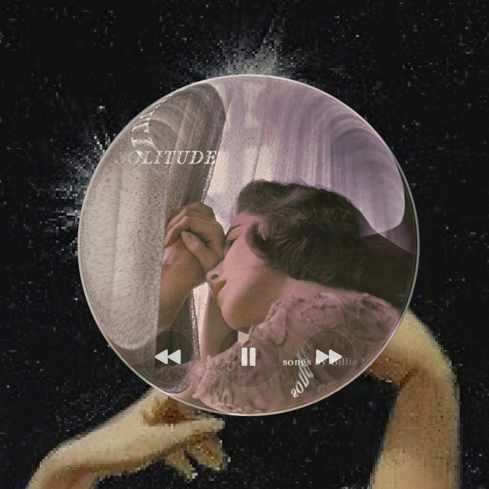
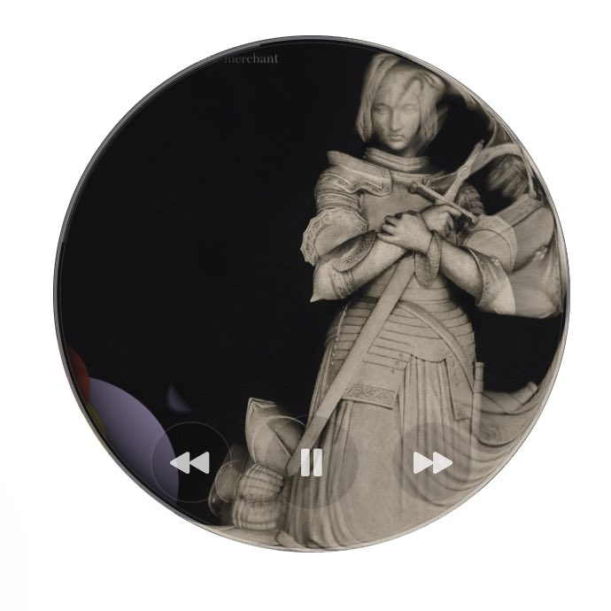

# Round Music Widget

Turn the artwork currently playing in Apple Music into a floating bubble for your Mac.

Round Music Widget keeps the current track on the desktop as a draggable circular object with artwork, motion and the essential playback controls. It is intentionally small, tactile and built to bring a little more pleasure to everyday listening.



## The idea

Apple Music already gives every track a visual identity, but that artwork usually disappears behind the rest of the desktop. Round Music Widget lets it stay present without becoming another dashboard or full-size player.

The interface behaves like a soft glass lens. The centre preserves the artwork while the outer rim stretches and bends it into the edge of the circle.



## What it does

- Shows the current Apple Music track artwork
- Adds a circular title and artist marquee on hover
- Provides previous, play-pause and next controls
- Offers four proportional sizes
- Moves freely and remembers its desktop position
- Can stay above other windows
- Opens and closes automatically with Apple Music
- Sends no telemetry and makes no network requests



## How it behaves

1. Open Apple Music and the widget appears.
2. Change tracks and the artwork updates.
3. Hover to reveal the moving title, artist and controls.
4. Drag the artwork to place it anywhere on the desktop.
5. Quit Apple Music and the widget closes with it.

If you close the widget manually while Music remains open, it stays closed until Music is launched again.


## Status

Version 0.1.0 is a source-first beta. It is used daily on Apple silicon, has been tested with multiple displays, and builds successfully on macOS 14 and macOS 26. Broader macOS and Intel testing is welcome.

## Requirements

- macOS 14 or later
- Apple Music
- Apple's free Command Line Tools

If the Command Line Tools are missing, install them with:

```sh
xcode-select --install
```

No paid Apple Developer account is required.

## Install

Download or clone this repository, open Terminal in its directory and run:

```sh
./scripts/install.sh
```

The installer builds the app locally, applies an ad hoc signature, installs it in `~/Applications`, and creates a user LaunchAgent that follows Apple Music's lifecycle.

The first time the widget reads or controls Apple Music, macOS may ask for Automation permission. Approve access to Music for the controls and artwork to work.

## Update

Pull or download the newer source, then run the installer again:

```sh
./scripts/install.sh
```

## Uninstall

From the repository directory, run:

```sh
./scripts/uninstall.sh
```

This removes the app and its LaunchAgent. It does not change Apple Music or disable any macOS security setting.

## Build without installing

```sh
./scripts/package-app.sh
```

The packaged app is written to `dist/Round Music Widget.app`.

## Privacy and security

Round Music Widget communicates only with the local Music application through macOS Apple Events. Track metadata and artwork remain on the Mac, and the artwork cache uses the current user's temporary directory.

This project does not publish prebuilt application binaries. The official release is the source in this repository, built locally by each user. A binary offered by a fork, mirror or third-party download site has not been built, reviewed or endorsed by Marie Drouvin.

The project deliberately does not ask users to disable Gatekeeper. Public binaries are not currently distributed because frictionless third-party macOS binaries require a paid Developer ID certificate and Apple notarization.

Please report suspected vulnerabilities privately through GitHub's security reporting interface. Do not include sensitive details in a public issue.

## Known limitations

- Apple Music must be running.
- Some tracks do not expose artwork through AppleScript; the widget then shows a neutral music symbol.
- The first public beta has primarily been tested on Apple silicon.
- The interface is currently English-only.

## Development

Build both Swift executables with:

```sh
swift build
```

The main application lives in `Sources/RoundMusicWidget`. The helper in `Sources/MusicLifecycleWatcher` observes Apple Music launch and termination events. The installer generates the machine-specific LaunchAgent path at installation time.

## Author

Built by [Marie Drouvin](https://notes.mariedrouvin.com/) with Codex.

The first public glimpse of the widget appeared in [this Substack note](https://substack.com/@mariedrouvin/note/c-346151414).

## Licence

Released under the [MIT Licence](LICENSE).

Apple Music is a trademark of Apple Inc. This independent project is not affiliated with or endorsed by Apple.
